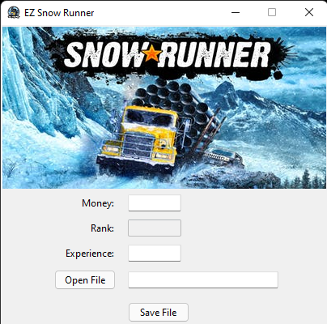

# EZ SnowRunner

This little tool was made to make your life easy on Snow Runner by changing your amount of money and experience

## What it does?

- Change the amount of money you have
- Cheat your experience points (XP)

## How to use

### Easy and Fast Way
- Download the release and run
 **Maybe your anti-virus will alert you that is harmfull** I don't know why 
 
- If not work just clone this project or download the zip file and follow the steps bellow

### Installing Python
1. Download [Python](https://www.python.org/downloads/)
2. Just install it after download

### Installing Modules
1. Open your Windows Console/Terminal in your **EZ SnowRunner** folder
2. Run the command "pip install -r requirements.txt"

### How to Run
1. Once you follow the procedures above
2. In your **EZ SnowRunner** folder run the command "python app.py"
3. If it's fine this screen below will pop up

4. Open your "CompleteSave.dat" usually located on C:\Users\(YOUR USER)\Documents\My Games\SnowRunner\base\storage\(RAMDOM CHARACTERS) 
  (ex: C:\Users\JamesPC\Documents\My Games\SnowRunner\base\storage\0fgue732s2843h219hz921923jzj1)
5. Type the ammount of money and experience you want
6. Save it
7. Restart the game
8. You are good to go
